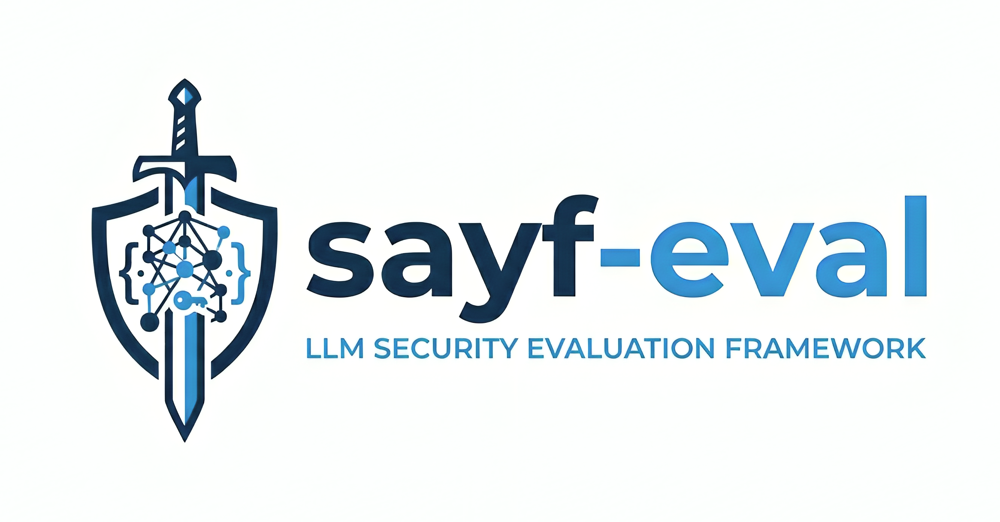

<p align="center">
  
</p>

<h1 align="center">sayf-eval</h1>

<p align="center">
  <em>A lightweight, model-agnostic framework for evaluating LLMs on cybersecurity benchmarks.</em>
</p>

<p align="center">
  <a href="https://www.python.org/downloads/"></a>
  <a href="LICENSE"></a>
  <a href="https://pypi.org/project/sayf-eval/"></a>
  
</p>

---

**sayf** (Arabic: *sword*) **-eval** evaluates any LLM — hosted API or local
checkpoint — through **one common interface**. It rests on two layers kept
separate:

- **Transport — [LiteLLM](https://github.com/BerriAI/litellm):** one `Model`
  adapter for every provider (OpenAI, Anthropic, Azure, …) and any
  OpenAI-compatible local server (vLLM via a `base_url`). No per-provider glue.
- **Structure — [lighteval](https://github.com/huggingface/lighteval)-shaped:**
  a `Task` / `Model` / `Scorer` boundary with a two-level metric split
  (sample-level extract+verdict, corpus-level aggregation).

The **judge is not special** — it is another `Model`, so the model-under-test
and the judge can each be any provider with no code change.

## Architecture

```
Task (prompt + params + dataset)
   └─> Model.generate(messages, params)        # LiteLLM under the hood
          └─> Scorer
                judge: Model                    # same type as the model
                extract + verdict (sample level)
                aggregate (corpus level)        # accuracy, VSP MAD, set F1
```

| Module | Role |
|--------|------|
| `sayf_eval/model.py` | `Model` (LiteLLM adapter), `GenParams`, `Response`, concurrent `generate_batch` |
| `sayf_eval/task.py` · `registry.py` | `Sample`, `Task`, the task registry |
| `sayf_eval/judge_prompts.py` | unified judge prompt + per-task format/compare rules |
| `sayf_eval/scorer.py` | judge call, `<think>`-strip, JSON-verdict parsing, skipped handling |
| `sayf_eval/metrics.py` | corpus aggregation (accuracy, ATE micro-F1, VSP MAD) |
| `sayf_eval/datasets.py` · `tasks/` | dataset loaders + task registrations |
| `sayf_eval/pipeline.py` · `cli.py` | end-to-end run loop and CLI |

## Install

```bash
pip install sayf-eval
# or, from source:
pip install -e ".[dev]"
```

## Quick start

```bash
# Credentials: LiteLLM reads provider keys from the environment.
export OPENAI_API_KEY=...   ANTHROPIC_API_KEY=...

# End-to-end: inference + judge across a few tasks
sayf-eval run \
  --tasks mcq seceval vsp taa \
  --model openai/gpt-4o \
  --judge anthropic/claude-sonnet-4-20250514 \
  --output-dir outputs/gpt4o \
  --max-samples 5

# Or split the steps
sayf-eval run-inference --tasks mcq --model openai/gpt-4o --output-dir outputs/gpt4o
sayf-eval run-judge     --tasks mcq --judge openai/gpt-4o --output-dir outputs/gpt4o
```

Outputs per task: `<task>_responses.jsonl`, `<task>_detailed.jsonl`, and a
combined `summary.json`.

### Local models (vLLM)

A local model is **just another endpoint**: serve it OpenAI-compatibly and point
sayf-eval at its `base_url`.

```bash
# Serve (tuning flags that used to live in scripts now live at serve time):
vllm serve Qwen/Qwen3-8B --port 8000 --enforce-eager

# Evaluate through the same interface (note the hosted_vllm/ prefix + base-url):
sayf-eval run \
  --tasks mcq vsp \
  --model hosted_vllm/Qwen/Qwen3-8B --base-url http://localhost:8000/v1 --api-key EMPTY \
  --judge anthropic/claude-sonnet-4-20250514 \
  --output-dir outputs/qwen3-8b
```

For reasoning models, pass `--answer-stop` to apply a stop sequence to the answer
*after* the `<think>` block is stripped, and `--max-tokens` to scale the budget.

## Tasks

24 cybersecurity sub-tasks across 8 benchmark families (`sayf-eval run --tasks …`):

- **CTI-Bench:** `mcq`, `rcm`, `vsp`, `ate`, `cti_taa`
- **AthenaBench:** `ckt`, `rms`, `taa`, `athena_ate`, `athena_rcm`, `athena_vsp`
- **SECURE:** `secure_maet`, `secure_cwet`, `secure_kcv`
- **RedSage:** `redsage_frameworks`, `redsage_generals`, `redsage_skills`, `redsage_cli`, `redsage_kali`
- **Other MCQ:** `seceval`, `cybermetric`, `secbench`, `mmlu-cs`, `cissp`

`cissp` needs a dataset path via `SAYF_EVAL_CISSP_PATH` (not a public dataset);
all others load from HuggingFace / GitHub on first run.

## Standardized pipeline choices

sayf-eval applies fixed, documented choices that remove measurement artifacts
without changing task semantics: temperature 0 / top_p 1 / fixed seed; per-task
token budgets; `<think>` stripped before judging with the stop sequence applied
to the answer only; and **denominator = all attempted items** (unparseable/empty
answers are incorrect; only judge-API failures are excluded — from both
numerator and denominator).

## Development

```bash
make install     # pip install -e ".[dev]"
make style       # ruff format + ruff check --fix
make quality     # ruff format --check + ruff check  (CI gate)
make test        # pytest
```

See [CONTRIBUTING.md](CONTRIBUTING.md) to get involved.

## License

[MIT](LICENSE).
